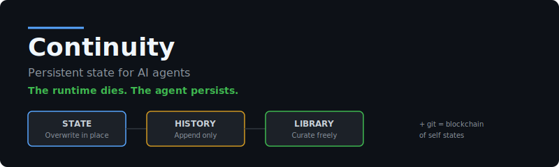
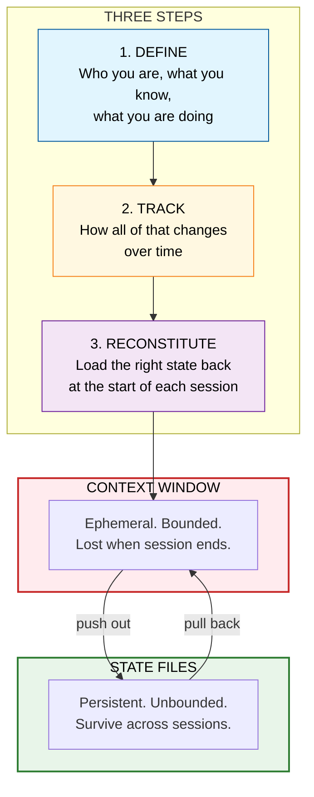
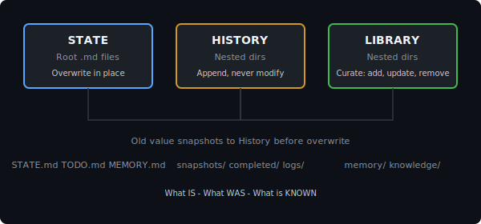
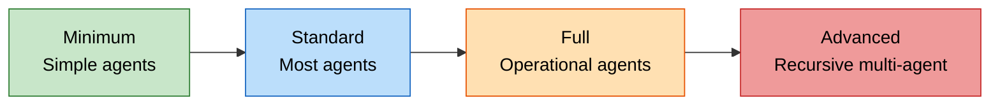
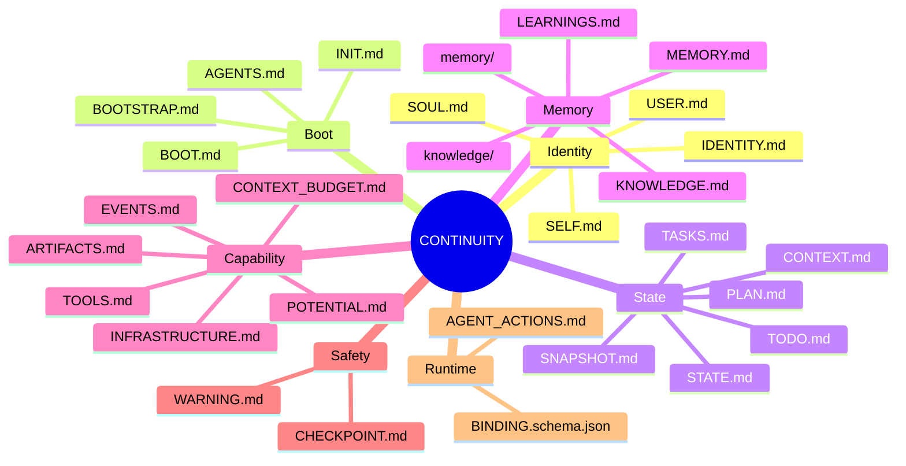
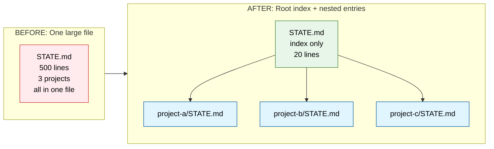
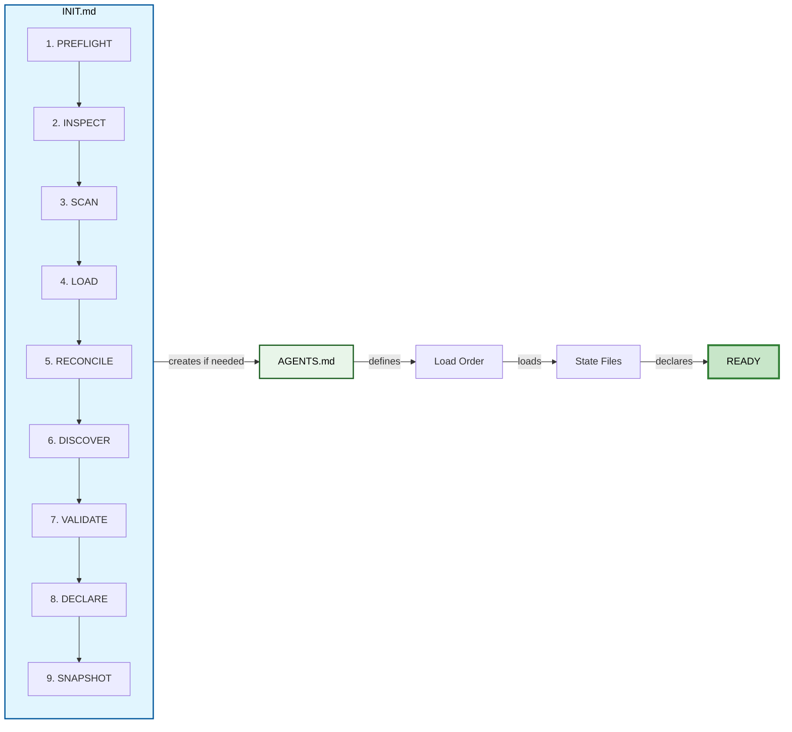
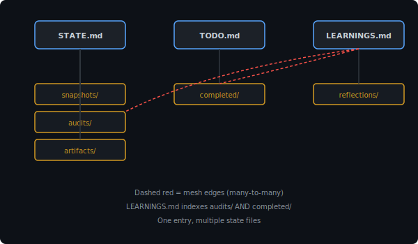
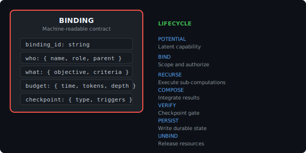

<div align="center">



[](LICENSE) · [](#pick-your-tier)

[`Quick Start`](#60-second-quick-start) · [`Packs`](#state-packs-not-a-fixed-identity) · [`Tiers`](#pick-your-tier) · [`File Types`](#the-ontology-state--history--library) · [`Prior Art`](#prior-art) · [`FAQ`](#faq)


</div>

---

<details>
<summary><b>Table of Contents</b></summary>

1. [The core idea](#the-core-idea)
2. [Why a single file is not enough](#why-a-single-file-is-not-enough)
3. [Loops are the units of intelligence](#loops-are-the-units-of-intelligence)
4. [60-second quick start](#60-second-quick-start)
5. [The ontology: State / History / Library](#the-ontology-state-history-library)
6. [Pick your tier](#pick-your-tier)
7. [File clusters](#file-clusters)
8. [State packs, not a fixed identity](#state-packs-not-a-fixed-identity)
9. [State-as-code](#state-as-code)
10. [CLAUDE.md, HERMES.md, or AGENTS.md is required](#claudemd-hermesmd-or-agentsmd-is-required)
11. [Auto-injection](#auto-injection)
12. [Self-updating is the key](#self-updating-is-the-key)
13. [What CONTINUITY gives you vs what you provide](#what-continuity-gives-you-vs-what-you-provide)
14. [Deployment modes](#deployment-modes)
15. [Nesting model](#nesting-model)
16. [Scoped state resolution](#scoped-state-resolution)
17. [Post-action reconciliation](#post-action-reconciliation)
18. [When state files grow too large](#when-state-files-grow-too-large)
19. [Boot sequence](#boot-sequence)
20. [Git: versioned cognitive snapshots](#git-versioned-cognitive-snapshots)
21. [Mesh: one entry, multiple state files](#mesh-one-entry-multiple-state-files)
22. [Mesh index](#mesh-index)
23. [Schema and mesh are interconnected](#schema-and-mesh-are-interconnected)
24. [Advanced: vector retrieval and schema validation](#advanced-vector-retrieval-and-schema-validation)
25. [Nested directories: the other half of the system](#nested-directories-the-other-half-of-the-system)
26. [Runtime contracts](#runtime-contracts)
27. [What makes this work](#what-makes-this-work)
28. [Invariants (hard rules — cannot self-violate)](#invariants-hard-rules-cannot-self-violate)
29. [Pre-action checklist](#pre-action-checklist)
30. [Design decisions](#design-decisions)
31. [Prior art](#prior-art)
32. [FAQ](#faq)
33. [Complete file map](#complete-file-map)
34. [Scripts](#scripts)

</details>

---


## The core idea

An AI agent has no persistent state. Every session it wakes up blank. No memory of past work. No identity. No plan. No record of what it learned.

CONTINUITY files externalize the agent's entire cognitive state into structured, versioned files. Identity, knowledge, context, and intent survive across sessions.


The context window is ephemeral and bounded. The state files are persistent and unbounded. You push everything that matters outside the window into files, then selectively pull back only what you need each session.

> [!IMPORTANT]
> The runtime dies. The agent persists. Add git and every commit becomes a verifiable snapshot of cognitive state.

---


---

## Why a single file is not enough

A single instruction file — [CLAUDE.md](https://claude.md/), [AGENTS.md](https://agents.md/), agent-name.md — works for small projects. It breaks as the agent grows:

| Limit | Single file | CONTINUITY |
|------|------------|------------|
| **Length** | Grows until it exceeds the context budget | Split by concern, each file bounded |
| **Loading** | All or nothing — load the whole file or skip it | Load only what you need — tiers, opt-out, on-demand |
| **History** | Overwriting erases the previous state | Nested dirs preserve every value. Git links every version. |
| **Concerns** | Identity, state, memory, and tasks share one file | Each concern has its own file with its own lifecycle |
| **Composition** | One file serves one scope | Any file nests into any project. Parent/child hierarchy. |
| **Relationships** | Linear text — no cross-references | Mesh: files index each other, many-to-many edges |

You read `STATE.md` to find the current state. You read `TODO.md` to find tasks. Each concern is a separate file with its own lifecycle. The ontology gives every file a type, a location, and a mutability rule.

<p align="right"><a href="#top">↑ Back to top</a></p>

---

## Loops are the units of intelligence

A loop is: observe → reason → act → update state. Intelligence compounds across loop iterations.

Without CONTINUITY: Every observe → act → verify → decide loop starts from zero. The agent re-discovers, re-learns, re-orients every session. The loop is stateless — intelligence evaporates when the session ends.

With CONTINUITY: The loop inherits — it wakes up knowing what it observed, what it decided, what it's verifying against. The state file is the loop's memory across iterations.

CLAUDE.md declares:
- What loops exist (reasoning loop, planning loop, execution loop)
- What state each loop reads on entry
- What state each loop writes on exit
- Loop dependencies (which loop's output feeds which loop's input)

State files exist to serve loops. TODO.md exists because the execution loop reads it. IDENTITY.md exists because the reasoning loop needs it stable. Remove a loop, remove its state files.

<p align="right"><a href="#top">↑ Back to top</a></p>

---

## 60-second quick start

```bash
# 1. Clone

git clone https://github.com/bitwikiorg/continuity.git

# 2. Copy the minimum files to your agent workspace

cp continuity/{AGENTS,IDENTITY,SELF,SOUL,STATE,INIT,TODO,SNAPSHOT}.md /your/workspace/

# 3. Replace placeholders

# Search for {{UPPER_CASE}} markers and fill in your agent's values

# 4. Boot

# INIT.md runs -> creates/validates AGENTS.md -> load order -> declares READY

# 5. Add git for history

cd /your/workspace/ && git init && git add -A && git commit -m "initial state"
```

Existing agents: run `INIT.md` against your current workspace. It inspects what exists, maps your state onto the file structure, creates missing files, and reconciles.

<p align="right"><a href="#top">↑ Back to top</a></p>

---

## The ontology: State / History / Library

This is the core mental model.



| Class | Where | Mutability | What it answers |
|-------|-------|-----------|----------------|
| **State** | Root `.md` files | Overwrite in place | What IS |
| **History** | Nested dirs (append-only) | Append, never modify | What WAS |
| **Library** | Nested dirs (curated) | Add, update, remove | What is KNOWN |

State holds one current value. When overwritten, the old version lands in its nested pair first — current value in the root, history in the nested dir. No data lost.

History is time-bound: snapshots, completed tasks, journals, audits. Each entry is a new file. Old entries are preserved.

Library is timeless: memory entries, knowledge docs. Curate freely — add, update, remove as facts change.

<p align="right"><a href="#top">↑ Back to top</a></p>

---

## Pick your tier

These tiers are suggested starting templates, not requirements. Use the smallest set of files that preserves useful CONTINUITY for your agent. Add files only when the agent repeatedly needs that kind of state.



| Tier | Files | For |
|------|-------|-----|
| **Minimum** | AGENTS, IDENTITY, SELF, SOUL, STATE, INIT, TODO, SNAPSHOT | Simple agents |
| **Standard** | + USER, MEMORY, TOOLS, PLAN, CONTEXT, TASKS, LEARNINGS, HEARTBEAT | Most agents |
| **Full** | + INFRASTRUCTURE, POTENTIAL, CONTEXT_BUDGET, MISSIONS, BACKLOG, WARNING, BOOTSTRAP, KNOWLEDGE, EVENTS, ARTIFACTS, BOOT | Operational agents |
| **Advanced** | + CHECKPOINT, AGENT_ACTIONS, BINDING.schema.json | Recursive multi-agent systems |

<p align="right"><a href="#top">↑ Back to top</a></p>

---

## File clusters



| Cluster | Icon | Files | What it does |
|---------|------|-------|-------------|
| **Identity** | 🧬 | [IDENTITY.md](IDENTITY.md), [SOUL.md](SOUL.md), [SELF.md](SELF.md), [USER.md](USER.md) | Who the agent is, how it behaves, who it serves |
| **Boot** | 🔄 | [INIT.md](INIT.md), [AGENTS.md](AGENTS.md), [BOOT.md](BOOT.md), [BOOTSTRAP.md](BOOTSTRAP.md) | How the agent starts up and reconstructs itself |
| **State** | 📍 | [STATE.md](STATE.md), [CONTEXT.md](CONTEXT.md), [PLAN.md](PLAN.md), [TODO.md](TODO.md), [TASKS.md](TASKS.md), [SNAPSHOT.md](SNAPSHOT.md) | Current truth, work tracking, restoration anchor |
| **Memory** | 🧠 | [MEMORY.md](MEMORY.md), [KNOWLEDGE.md](KNOWLEDGE.md), [LEARNINGS.md](LEARNINGS.md) + `memory/`, `knowledge/` dirs | Durable facts, insights, knowledge library |
| **Capability** | 🛠️ | [TOOLS.md](TOOLS.md), [INFRASTRUCTURE.md](INFRASTRUCTURE.md), [POTENTIAL.md](POTENTIAL.md), [CONTEXT_BUDGET.md](CONTEXT_BUDGET.md), [EVENTS.md](EVENTS.md), [ARTIFACTS.md](ARTIFACTS.md) | What the agent can use and what's available |
| **Safety** | 🚨 | [WARNING.md](WARNING.md), [CHECKPOINT.md](CHECKPOINT.md) | Hard limits, approval gates |
| **Runtime** | ⚙️ | [AGENT_ACTIONS.md](AGENT_ACTIONS.md), [BINDING.schema.json](BINDING.schema.json) | Optional execution discipline for recursive agents |

<p align="right"><a href="#top">↑ Back to top</a></p>

---

## State packs, not a fixed identity

CONTINUITY is a stub, scaffold, and state pack library for persistent agent state. A pack is a cohesive set of state files wired for one operating mode — not a single template. The files here are starting structures with `{{VARIABLES}}` to fill in. Copy a pack, delete what does not apply, rename files, split files, merge files, and generate your own state layout for your agent, project, team, or runtime.

### Available packs

| Pack | Purpose | Files |
|------|---------|-------|
| [developer](packs/developer/) | General coding agent | 7 |
| [backend](packs/backend/) | APIs, databases, auth | 5 |
| [frontend](packs/frontend/) | UI, routes, components | 4 |
| [researcher](packs/researcher/) | Long-running research | 6 |
| [judge](packs/judge/) | Evaluation and review | 6 |
| [security](packs/security/) | Risk and secrets control | 5 |
| [ops](packs/ops/) | Infrastructure and production | 5 |
| [orchestrator](packs/orchestrator/) | Multi-agent coordination | 6 |
| [docs-writer](packs/docs-writer/) | Documentation systems | 4 |

See [packs/README.md](packs/README.md) for selection guide and combining packs.

### Runtime adapters

Continuity ships a runtime-agnostic skill with thin adapters for each major agent runtime:

| Runtime | Entry file | Adapter |
|---------|-----------|---------|
| Claude Code | CLAUDE.md | [adapters/claude.md](skills/continuity/adapters/claude.md) |
| OpenAI Codex | AGENTS.md | [adapters/codex.md](skills/continuity/adapters/codex.md) |
| Hermes | AGENTS.md | [adapters/hermes.md](skills/continuity/adapters/hermes.md) |
| OpenClaw | AGENTS.md | [adapters/openclaw.md](skills/continuity/adapters/openclaw.md) |
| Agent Zero | AGENTS.md | [adapters/agent-zero.md](skills/continuity/adapters/agent-zero.md) |

### Hooks

Optional automation for state file changes. Watch STATE.md, TODO.md, or SNAPSHOT.md and trigger webhooks, event logs, or task moves. See [hooks/](hooks/) for example YAML config and webhook script. Hooks are optional — the feedback loop works without them.

The principle is fixed:

1. Externalize agent state into readable, versioned files.
2. Load only the relevant state at runtime.
3. Update state when reality changes.
4. Preserve history when current state is overwritten.

The implementation is yours. A coding agent may only need `AGENTS.md`, `STATE.md`, and `TODO.md`. A research agent may need `MEMORY.md`, `KNOWLEDGE.md`, and `LEARNINGS.md`. A multi-agent runtime may need `CHECKPOINT.md`, `TOOLS.md`, and `BINDING.schema.json`. CONTINUITY provides the grammar. You generate the language.

## State-as-code

State files aren't passive — they're executable contracts. The agent maintains them because its own boot logic requires them to exist and be correct. The agent then follows its own specification as it runs.

---

## CLAUDE.md, HERMES.md, or AGENTS.md is required

CLAUDE.md (or AGENTS.md, or HERMES.md — whatever your agent auto-loads) is the entry point. It declares the state topology: which files exist, what loads on boot, and state governance rules. Without it, CONTINUITY becomes a folder of orphaned docs.

For agents that auto-load these files (Claude Code loads CLAUDE.md, Cursor loads .cursorrules, Hermes loads AGENTS.md, Agent Zero uses AGENTS.promptinclude.md), nest your state references there. The agent enforces the pattern by reading its own spec — CLAUDE.md says "load TODO.md at start and check it before executing tasks" and the agent does that because it's runtime spec.

Enforcement = self-reference. The file declares what state exists; the agent follows its own specification as it runs.

Most cases: AGENTS.md + TODO.md + optional identity file. Add more only if the agent's loop actually needs them.

## Auto-injection

Some frameworks auto-inject files into the agent's context. AGENTS.promptinclude.md in this repo is for tools that support auto-loading (like Cursor's .cursorrules, Agent Zero's promptinclude). The agent reads these files automatically on every session — no manual loading needed.

If your agent supports auto-injection (Claude Code, Cursor, Hermes, Agent Zero), put your load order and state references in the auto-loaded file. The agent enforces it by self-reference.

## Self-updating is the key

The agent writes these files, not just reads them. After completing work:

- Updates STATE.md with new status
- Moves done tasks from TODO.md to completed/
- Appends learnings to memory/

Without this, it's just static config. The value is the feedback loop.

CONTINUITY is templates + grammar, not a framework. The operator owns the plumbing.

## What CONTINUITY gives you vs what you provide

CONTINUITY gives you:
- Structured markdown templates for agent state (STATE, TODO, MEMORY, etc.)
- Scoping model (load src/auth/STATE.md not global STATE)
- Nesting pattern (files grow → split into subdirs)
- Mesh concept (one entry serves multiple state files)
- Git as history layer

You provide:
- How the agent reads files (bash cat? MCP? direct I/O?)
- How it writes (same — your choice)
- Validation (schema or trust)
- Merge/conflict handling (git's default or custom)
- Commit cadence (auto, manual, staged)

---

## Deployment modes

Three ways to deploy. Structure is fixed, deployment is flexible.

| Mode | What | When |
|------|------|------|
| **Full** | All files at root | Agent needs full CONTINUITY |
| **Nested** | State files inside projects | Different projects need different state |
| **Scoped** | Only the files you need, where you need them | Minimal CONTINUITY |

```graphql
# Full
/AGENTS.md /IDENTITY.md /STATE.md /TODO.md ...

# Nested — ANY file can nest, not just AGENTS.md
/AGENTS.md
/project-a/STATE.md /project-a/TODO.md /project-a/CONTEXT.md
/project-b/STATE.md /project-b/TODO.md

# Scoped
/project-a/AGENTS.md /project-a/STATE.md
```

> [!TIP]
> All files can be nested and moved into any project. Different projects can have their own `STATE.md`, `TODO.md`, `CONTEXT.md`. Pick the files you need per project. The system does not prescribe deployment — it prescribes structure.

<p align="right"><a href="#top">↑ Back to top</a></p>

---

## Nesting model

All state files can nest — `STATE.md`, `TODO.md`, `MEMORY.md`, `CONTEXT.md`, any file. Place any file at any level — root, project, subsystem. Each level captures a complete system at its scope. `AGENTS.md` is one example; every file in this system can be nested the same way.

```graphql
/AGENTS.md /STATE.md /TODO.md /MEMORY.md     # root: global state
├── /project-a/STATE.md /project-a/TODO.md   # child: project-specific state
│   ├── /project-a/sub/STATE.md              # grandchild: subsystem state
├── /project-b/STATE.md /project-b/MEMORY.md # child: different project
```

| Rule | What it means |
|------|----------------|
| **Child inherits** | Load order, authority model, safety defaults flow down |
| **Child refines** | Adds project-specific params, narrows scope |
| **Child cannot weaken parent** | Safety rules and authority boundaries are preserved |
| **Conflict resolution** | Parent wins. Escalate to `STATE.md` blockers. |
| **Discovery** | `INIT.md` builds hierarchy tree, loads parent before child |

A child declares its parent:

```yaml
parent: ../STATE.md
refines:
  - scope: project-a only
  - adds: project-specific entries
  - overrides: index (adds project files)
```

Nest the files that grow too large or need project-specific scope. The mesh forms from how you wire the files together.

### Practical nesting example

```graphql
/my-project
  AGENTS.md          ← global identity
  STATE.md           ← "Current: Building auth"
  TODO.md            ← high-level tasks

  /backend
    STATE.md         ← "Current: Refactoring JWT"
    TODO.md          ← backend-specific tasks
    /auth
      STATE.md       ← "Current: Writing tests"
```

Claude Code working in `/backend/auth/` loads:
- Root AGENTS.md (identity)
- Root STATE.md (project status: "Building auth")
- /backend/STATE.md (subsystem status: "Refactoring JWT")
- /backend/auth/STATE.md (current task: "Writing tests")

## Scoped state resolution

Before an agent acts, it resolves the state chain that governs the work area. It starts at the highest available scope, loads the relevant root files, then descends into project, subsystem, task, or runtime-specific files until it reaches the nearest applicable state.

The nearest state gives local precision. The parent state gives global CONTINUITY. A child may refine scope, add detail, narrow behavior, or specialize context. A child may not silently weaken parent constraints.

```text
Global state → project state → subsystem state → task state → current action
```

The agent does not load every file by default. It loads the smallest state chain sufficient for the action.

```graphql
# Code edit — minimal chain
/AGENTS.md /STATE.md /TODO.md /src/AGENTS.md /src/auth/AGENTS.md /src/auth/STATE.md

# Research — minimal chain
/IDENTITY.md /STATE.md /MEMORY.md /KNOWLEDGE.md /research/STATE.md /research/SOURCES.md

# Multi-agent run — minimal chain
/STATE.md /TOOLS.md /CHECKPOINT.md /BINDING.schema.json /runs/active/STATE.md /runs/active/TASKS.md
```

The rule:

```text
Resolve scope before action.
Obey the nearest applicable state.
Preserve parent constraints.
Update affected state after meaningful change.
```

## Post-action reconciliation

After a meaningful change, the agent updates the files whose claims are no longer accurate. A task completion may update `TODO.md`, `STATE.md`, `SNAPSHOT.md`, and `completed/`. A new tool may update `TOOLS.md`, `INFRASTRUCTURE.md`, and `setup/`. A lesson learned may update `LEARNINGS.md` or `memory/`.

The agent does not preserve stale state for politeness. If reality changed, state changes.

```text
Action changes reality.
Reality invalidates old state.
Old state is preserved when needed.
Current state is rewritten.
Indexes are reconciled.
```

This is what prevents CONTINUITY drift.

<p align="right"><a href="#top">↑ Back to top</a></p>

---

## When state files grow too large

A state file starts as a single root document. As the agent accumulates context, the file grows. Eventually it exceeds what the agent can load efficiently in a single context window.

At that point, the state file nests. It splits into a root index plus nested entries:



The root file becomes an index — it points to nested entries that hold the actual content. The agent loads the index first, then pulls only the nested entries it needs. All state files can nest this way, not just `AGENTS.md`. The nesting forms a mesh of interconnected state.

<p align="right"><a href="#top">↑ Back to top</a></p>

---

## Boot sequence

Two scenarios: a new agent starts from templates, or an existing agent assimilates into the system.

### New agent

Copy the template files, replace `{{PLACEHOLDERS}}`, and boot. `INIT.md` runs the 9-stage reconstitution procedure and creates `AGENTS.md` if it does not exist.

### Existing agent

An existing agent with its own state — scattered files, ad-hoc instructions, memory in various formats — assimilates into the system by mapping its current state onto the file structure. `INIT.md` inspects what exists, determines what maps to which files, creates missing files, and reconciles.



| File | When | What |
|------|------|------|
| [INIT.md](INIT.md) | First run + every session | Reconstitution procedure. 9 stages. May create AGENTS.md. |
| [AGENTS.md](AGENTS.md) | Every session | Living instruction file. Bootloader + runtime params + project guard. |
| [BOOT.md](BOOT.md) | Every wake (optional) | Lightweight CHECK → ACT → REPORT cycle for heartbeats. |
| [BOOTSTRAP.md](BOOTSTRAP.md) | First run only | Identity discovery ritual. Self-destructing. |

<p align="right"><a href="#top">↑ Back to top</a></p>

---

## Git: versioned cognitive snapshots

Every commit captures the agent's full state at a point in time. You can diff between commits to see what changed, revert to a previous state, or branch to try a different approach.

Every commit is a verifiable checkpoint of the agent's cognitive state. If the agent drifts, you can see exactly when and why.


| Git concept | What it means for agent state |
|-------------|-------------------------------|
| Commit | A snapshot of the agent's full cognitive state at that moment |
| SHA hash | Verifiable fingerprint — prove the state hasn't been tampered with |
| Parent linkage | Ordered history — trace how state evolved |
| Branch | Try a different approach without losing the original |
| Merge | Reconcile divergent state paths |
| `git checkout <hash>` | Restore the agent to a previous cognitive state |
| `git blame` | Provenance — who changed what and when |
| `git diff` | See exactly what changed between two cognitive states |

> [!NOTE]
> Git history is raw byte-level diff. Nested dirs are structured, queryable history organized by concern. Two layers: git for verifiable snapshots, nested dirs for agent-readable semantic history.

A single file in git gives you file history — the diff is noise because all concerns share one file. CONTINUITY + git gives you state history — you can see exactly when `STATE.md` changed, what `TODO.md` contained last week, what the agent knew on June 15th versus June 28th.

<p align="right"><a href="#top">↑ Back to top</a></p>

---

## Mesh: one entry, multiple state files

Without meshing: each module's STATE.md is isolated. You don't see cross-module impacts.
With meshing: state files declare dependencies via shared indexed directories. The agent can trace: "If I change src/shared/artifacts/, which STATE files care?" That's how you avoid silent regressions in a multi-session build.



The dashed red lines show the mesh: one audit entry serves both `STATE.md` (current health) and `LEARNINGS.md` (what was learned). One entry, multiple state files.

### Mesh vs Hierarchy

Hierarchy (parent-child): STATE.md → project-a/STATE.md → task-42/STATE.md

Mesh (many-to-many): Multiple state files index the same directory entry.

```text
STATE.md ─────┐
              ├──→ audits/2026-06-29-security.md
LEARNINGS.md ─┘
```

One audit entry serves both files. That's a mesh edge.

### Concrete Mesh Patterns

**Pattern 1: Shared History**
```text
STATE.md indexes: snapshots/, audits/, artifacts/
LEARNINGS.md indexes: reflections/, audits/, completed/
                          ↑
                    same directory
```

Security audit goes to `audits/2026-06-29-security.md`:
- STATE.md references it as "current system health: secure"
- LEARNINGS.md references it as "learned: rate limiting prevents brute force"
One file, two contexts. No duplication.

**Pattern 2: Cross-Cutting Memory**
```text
MEMORY.md indexes: memory/semantic-*
KNOWLEDGE.md indexes: knowledge/docs, memory/semantic-*
```

`memory/semantic-server-ip.md` is referenced by MEMORY.md ("current server IP") and KNOWLEDGE.md ("infrastructure facts").

**Pattern 3: Artifact Provenance**
```text
ARTIFACTS.md indexes: artifacts/
STATE.md indexes: artifacts/, snapshots/
```

`artifacts/api-v2.spec.md` is referenced by ARTIFACTS.md ("deliverable exists") and STATE.md ("current spec version").

Mesh decouples storage from context. The audit lives in one place. State files choose how to interpret it.

### Mesh Declaration

The mesh is explicit, not automatic. Each state file declares its edges in a "Mesh index" section:

```markdown
# STATE.md

## Mesh index
- **Indexes:** `snapshots/`, `audits/`, `artifacts/`
- **Rule:** When overwriting, snapshot old version to `snapshots/` first
```

No declaration = no edge. This prevents accidental spaghetti.

### Query Pattern (The Payoff)

With explicit mesh indexes, you can ask your agent:

> "I changed `src/shared/auth.ts`. Which STATE files index `src/shared/`? What depends on this?"

The agent traces:
1. `src/shared/STATE.md` indexes `src/shared/`
2. `backend/api/STATE.md` indexes `../../src/shared/artifacts/`
3. `SECURITY.md` indexes `audits/` which contains `2026-06-29-auth-audit.md`

Cross-module impact visible. Silent regressions caught.

### When to Mesh

Create a mesh edge when:
- Same event matters to multiple concerns (state + learning + memory)
- You want history without bloating current state files
- Multiple agents share overlapping context

Skip meshing when:
- Data is truly private to one concern
- You're in Minimum tier (keep it simple)

The mesh is what turns 40 separate markdown files into a single coherent system. Without it, you just have a folder of notes.

### Start Hierarchy, Add Mesh

Don't mesh early. Begin with strict parent-child nesting. Add mesh edges only when you hit:
- Same audit serving state + learnings
- Memory referenced by both MEMORY.md and KNOWLEDGE.md
- Artifacts tracked in both ARTIFACTS.md and STATE.md

Sloppy meshing is worse than no meshing. The hierarchy is your safe default.

### Index vs Copy

Mesh indexes reference — the audit lives in one place. Don't copy content into state files. State files hold pointers (filenames, timestamps, hashes). The directory holds the payload.

This keeps state files small (loadable) while history grows unbounded (append-only).

## Schema and mesh are interconnected

The schema defines what can exist; the mesh defines how it connects. They're coupled at three points:

### 1. Taxonomy Determines Meshability

| Class | Can Mesh? | Why |
|---|---|---|
| State (root files) | Yes (outbound only) | Indexes History/Library dirs |
| History (append-only dirs) | Yes (inbound only) | Indexed by multiple State files |
| Library (curated dirs) | Yes (bidirectional) | Indexed by State; can index other Library |

A `snapshots/` entry (History) can serve both STATE.md and LEARNINGS.md. A `memory/` entry (Library) can serve MEMORY.md and KNOWLEDGE.md. But STATE.md itself (State class) is never indexed by other files — it's always the indexer, never the indexed.

### 2. Schema Changes Require Mesh Updates

Add a new state file? You must declare its mesh edges or it's isolated. Remove a state file? All mesh edges pointing to it become dangling. INIT.md validation catches this.

### 3. BINDING.schema.json Formalizes The Contract

For recursive agents (Advanced tier), the schema is machine-readable. Runtime validates: declared edges match actual directory structure. Schema drift detected.

You can't design the schema without considering the mesh topology. They're one system.

> [!IMPORTANT]
> 30+ files is heavy. Most agents need 3-5.
>
> The full template set exists because different loop types need different state shapes. A coding loop needs different continuity than a research loop than a multi-agent orchestration loop. The templates are loop patterns, not bloat.
>
> Start with AGENTS.md + TODO.md + STATE.md. Add files only when your agent's loop actually needs them.

## Advanced: vector retrieval and schema validation

Optional extensions for teams that need more. Vector stores let agents search state files semantically. Schema validation makes the mesh machine-readable.

### Vector Stores

State files can be sent to embedding models and stored in vector databases. This makes it easy to search across all states and large contexts. Agents can query entire state histories semantically. Hooks can trigger re-embedding when state files change.

| Capability | How it works |
|---|---|
| Semantic search | Embed state files, store in vector DB, query by meaning not filename |
| History recall | Search across snapshots, audits, and completed tasks by content |
| Auto re-embed | Hooks fire on STATE.md / TODO.md / SNAPSHOT.md changes → re-embed updated files |

### Schema-Validated Mesh

For teams that need machine-readable mesh validation, a three-layer pattern works:

| Layer | File | Role |
|---|---|---|
| Canonical graph | `SCHEMA.lua` | Machine-readable mesh graph — edges, dependencies, ownership |
| Per-file metadata | YAML frontmatter | Owner, scope, parent, indexes, write rules embedded in each `.md` |
| Validator | `schema_validate.py` | Bridge that validates both layers agree — detects drift, dangling edges, ownerless files |

The mesh becomes both human-readable (markdown prose) and machine-readable (schema + YAML + validator). Relationships, dependencies, and reconciliation triggers are queryable.

### When to add the advanced layer

Add vector stores when:
- Your state history exceeds what an agent can load in context.
- You need semantic recall across many sessions or projects.
- Multiple agents share a state directory and need to find relevant context without reading every file.

Add schema validation when:
- Your mesh has enough edges that manual tracking is error-prone.
- Multiple agents write to shared directories and you need ownership boundaries enforced.
- You want CI checks that catch dangling edges and schema drift before they cause silent regressions.

> [!NOTE]
> These are optional extensions. The core system — hierarchy, mesh, Git provenance, hooks — works without them. Add them when scale demands it.

## Nested directories: the other half of the system

State files hold current values. But where does old state go? Where does accumulated knowledge live? Where does generated output land? Nested directories — the History and Library classes from the ontology.

Each nested directory is indexed by a root state file. `STATE.md` indexes `snapshots/`, `audits/`, `artifacts/`. `TODO.md` indexes `completed/`. The table below is the other half of the mesh.

Two naming patterns, matching the taxonomy:
- **History dirs** — date-prefixed, append-only. Old entries are preserved.
- **Library dirs** — topic-slug, curated. Add, update, remove as facts change.

> [!NOTE]
> Each `ENTRY.template.md` is self-documenting — the YAML frontmatter IS the field specification. Copy it, rename it, fill it in.

| Directory | Class | Template | Naming pattern | Indexed by |
|-----------|-------|----------|---------------|------------|
| `completed/` | History | [ENTRY.template.md](completed/ENTRY.template.md) | `YYYY-MM-DD-task-slug.md` | `TODO.md` |
| `journal/` | History | [ENTRY.template.md](journal/ENTRY.template.md) | `YYYY-MM-DD-turn-N.md` | `CONTEXT.md` |
| `reflections/` | History | [ENTRY.template.md](reflections/ENTRY.template.md) | `YYYY-MM-DD-topic-slug.md` | `LEARNINGS.md` |
| `snapshots/` | History | [ENTRY.template.md](snapshots/ENTRY.template.md) | `YYYY-MM-DDTHH-MM-SS.md` | `STATE.md` |
| `audits/` | History | [ENTRY.template.md](audits/ENTRY.template.md) | `YYYY-MM-DD-type-slug.md` | `STATE.md`, `LEARNINGS.md` |
| `proposals/` | History | [ENTRY.template.md](proposals/ENTRY.template.md) | `YYYY-MM-DD-topic-slug.md` | `PLAN.md` |
| `setup/` | History | [ENTRY.template.md](setup/ENTRY.template.md) | `YYYY-MM-DD-tool-name.md` | `TOOLS.md` |
| `artifacts/` | History | [ENTRY.template.md](artifacts/ENTRY.template.md) | `YYYY-MM-DD-name.ext` | `STATE.md`, `ARTIFACTS.md` |
| `memory/` | Library | [ENTRY.template.md](memory/ENTRY.template.md) | `namespace-topic-slug.md` | `MEMORY.md` |
| `knowledge/` | Library | [ENTRY.template.md](knowledge/ENTRY.template.md) | `topic-slug.md` | `KNOWLEDGE.md` |

> [!NOTE]
> `audits/` is indexed by both `STATE.md` and `LEARNINGS.md` — that's the mesh. One audit entry, two state files.

<p align="right"><a href="#top">↑ Back to top</a></p>

---

## Runtime contracts

For agents that use bounded recursive delegation, the Advanced tier provides a binding lifecycle and machine-readable contract.



A binding is a finite authorization for a computation: who runs it, what the objective is, what tools are allowed, what the budget is, and when to stop. The lifecycle: POTENTIAL → BIND → RECURSE → COMPOSE → VERIFY → PERSIST → UNBIND.

- [CHECKPOINT.md](CHECKPOINT.md) — approval gate before irreversible actions
- [AGENT_ACTIONS.md](AGENT_ACTIONS.md) — action reference (conceptual)
- [BINDING.schema.json](BINDING.schema.json) — machine-readable binding contract

<p align="right"><a href="#top">↑ Back to top</a></p>

---

## What makes this work

Three structural decisions make the system hold together. Here is what each one looks like in practice.

### 1. Interconnected schema

`STATE.md` indexes `snapshots/`, `audits/`, and `artifacts/`:

```markdown
# STATE.md

## Invariants (hard rules — cannot self-violate)
1. Never expose secrets in output.
2. Never type passwords/API keys into forms.
3. No destructive operations without explicit approval.
...
```

[WARNING.md](WARNING.md) lists pre-action checklists:

```markdown
# WARNING.md

## Pre-action checklist
- [ ] Read STATE.md for current state
- [ ] Check WARNING.md hard limits
- [ ] Verify action is reversible or approved
```

[CHECKPOINT.md](CHECKPOINT.md) defines approval gates. Behavior is bound by the schema — the agent reads these files before acting.

### 3. State / History / Library taxonomy

```markdown
# State: STATE.md (overwrite in place)
Status: READY
Active objective: Deploy webhook

# History: snapshots/2026-06-27T14-30-00.md (append, never modify)
Previous state before webhook deployment

# Library: memory/semantic-server-ip.md (curate — add, update, remove)
Server IP is 192.0.2.1
```

When `STATE.md` is overwritten, the old version lands in `snapshots/` first. Current value in the root. History in the nested dir. No data lost.

<p align="right"><a href="#top">↑ Back to top</a></p>

---

## Design decisions

<details>
<summary><b>Three identity surfaces</b></summary>

- **SOUL.md** — essence, purpose, philosophy, constitution. Rarely changes.
- **SELF.md** — operating model, voice, hard invariants. Human-owned.
- **IDENTITY.md** — instance identity, relationships, rebinding policy. Immutable at runtime.

</details>

<details>
<summary><b>Structure / Potential / Void</b></summary>

Three-state capability model:

- **Structure** — what's bound, running, currently in use
- **Potential** — what's available but idle
- **Void** — the unknown. Capabilities you have not discovered, considered, or needed yet.

</details>

<details>
<summary><b>Context budget</b></summary>

Prompt context is finite. [CONTEXT_BUDGET.md](CONTEXT_BUDGET.md) defines auto-load budget, taint classes, exclusions, and log retention.

</details>

<details>
<summary><b>Completed work journal</b></summary>

`completed/` directory with entry template prevents TODO.md bloat. Done items move to journal with evidence and learnings.

</details>

<details>
<summary><b>LEARNINGS.md</b></summary>

Soft rules and insights between MEMORY.md (durable facts) and TODO.md (tasks).

</details>

<details>
<summary><b>Validation table in INIT.md</b></summary>

Checkbox table for every required file. Copy-pasteable declaration template.

</details>

<p align="right"><a href="#top">↑ Back to top</a></p>

---

## Prior art

| Approach | Link | What it is | How CONTINUITY differs |
|----------|------|-----------|----------------------|
| **CLAUDE.md** | [claude.md](https://claude.md/) | Single project instruction file | Split by concern — each file bounded, loadable independently |
| **AGENTS.md** | [agents.md](https://agents.md/) | Open standard for agent instructions | Uses AGENTS.md as one file in a larger ontology |
| **OpenClaw** | [docs.openclaw.ai](https://docs.openclaw.ai/) | Agent workspace templates (BOOT, BOOTSTRAP, SOUL, IDENTITY, HEARTBEAT, TOOLS, USER) | Inspired our boot/identity split. CONTINUITY adds mesh, taxonomy, versioned snapshots. |
| **Hermes** | [hermes-agent.nousresearch.com](https://hermes-agent.nousresearch.com/) | Context files with progressive discovery, security scanning, auto-loaded SOUL.md | Inspired our auto-injection and security scanning. CONTINUITY adds State/History/Library taxonomy. |
| **init.md** | [github.com/bitwikiorg/init.md](https://github.com/bitwikiorg/init.md) | 6-stage initialization protocol | Inspired our INIT.md 9-stage procedure. CONTINUITY extends with SCAN, DISCOVER, SNAPSHOT stages. |
| **System prompts** | — | Ephemeral session instructions | Persistent across sessions, survives runtime death |
| **.cursorrules** | [cursor.sh/docs](https://cursor.sh/docs) | Static project rules | State files update, history accumulates, mesh connects |
| **llms.txt** | [llmstxt.org](https://llmstxt.org/) | AI-readable site documentation | Agent state, site docs — nesting model is similar |

<p align="right"><a href="#top">↑ Back to top</a></p>

---

## FAQ

<details>
<summary><b>Isn't this over-engineered?</b></summary>

Stateful loop infrastructure. For one-off prompts, useless. For any agent that actually loops (iterates, plans, executes across sessions), this formalization is the difference between a forgetful assistant and an accumulating one.

You can do a lot with just AGENTS.md + TODO.md. The idea is verbalizing THAT THESE ARE STATE FILES and in order to maintain CONTINUITY you need to organize them as state files.

</details>

<details>
<summary><b>Can I use just one file?</b></summary>

Yes. Copy `AGENTS.md` alone. It's the bootloader, runtime params, and project guard. An agent can boot from it and declare READY with nothing else.

</details>

<details>
<summary><b>Do I need git?</b></summary>

No. The system works without git. But you lose verifiable history — no time travel, no provenance, no way to see what the agent knew last week. Git turns every commit into a checkpoint you can diff, revert, or trace.

</details>

<details>
<summary><b>Is this tied to a specific AI or framework?</b></summary>

No. The templates are runtime-agnostic. Any agent that can read markdown files can use them. `AGENTS.promptinclude.md` is for frameworks that support auto-injection, but it's optional.

</details>

<details>
<summary><b>Do I need all files?</b></summary>

No. Pick your tier. Minimum is 8 files. Most agents use Standard. Not all agents need all files — it depends how much contextual CONTINUITY you need.

</details>

<details>
<summary><b>Can I nest state files per project?</b></summary>

Yes. All files can be nested into any project, not just AGENTS.md. Different projects can have their own STATE.md, TODO.md, CONTEXT.md.

</details>

<details>
<summary><b>What is the mesh?</b></summary>

State files index nested directories as graph edges. One audit entry can serve both STATE.md (current health) and LEARNINGS.md (what was learned). Many-to-many relationships. The mesh is what makes this an ontology. Meshes can contain parent-child relations, but they are not limited by them — richness depends on how you wire the system data.

</details>

<details>
<summary><b>Do I have to use these exact files?</b></summary>

No. The files are stubs and templates with `{{VARIABLES}}`. They show one possible state ontology. You can generate your own files, remove unused files, rename files, or create domain-specific state files such as `SOURCES.md`, `EXPERIMENTS.md`, `CLIENTS.md`, `DATASETS.md`, `DEPLOYMENTS.md`, `EVALUATIONS.md`, or `RUNBOOK.md`. The important part is that agent state becomes explicit, scoped, versioned, loadable, and updateable. CONTINUITY provides the grammar. You generate the language.

</details>

<details>
<summary><b>Can an existing agent assimilate into this system?</b></summary>

Yes. Run `INIT.md` against your current workspace. It inspects what exists, maps your state onto the file structure, creates missing files, and reconciles. Existing agents do not need to start from scratch.

</details>

<p align="right"><a href="#top">↑ Back to top</a></p>

---

## Complete file map

<details>
<summary><b>All files in the repo</b></summary>

| File | Cluster | What it does |
|------|---------|-------------|
| [AGENTS.md](AGENTS.md) | Boot | Bootloader + runtime params + project guard |
| [INIT.md](INIT.md) | Boot | 9-stage reconstitution procedure |
| [BOOT.md](BOOT.md) | Boot | Optional lightweight every-wake cycle |
| [BOOTSTRAP.md](BOOTSTRAP.md) | Boot | First-run identity discovery (self-destructing) |
| [IDENTITY.md](IDENTITY.md) | Identity | Instance identity, relationships, rebinding policy |
| [SOUL.md](SOUL.md) | Identity | Essence, purpose, philosophy, constitution |
| [SELF.md](SELF.md) | Identity | Operating model, voice, hard invariants |
| [USER.md](USER.md) | Identity | Human model |
| [STATE.md](STATE.md) | State | Current operational truth |
| [CONTEXT.md](CONTEXT.md) | State | Per-turn operational snapshot |
| [PLAN.md](PLAN.md) | State | Intended sequence, phases, milestones |
| [TODO.md](TODO.md) | State | Tactical task index |
| [TASKS.md](TASKS.md) | State | System and housekeeping tasks |
| [SNAPSHOT.md](SNAPSHOT.md) | State | Restoration anchor |
| [MEMORY.md](MEMORY.md) | Memory | Current memories + index to entries |
| [KNOWLEDGE.md](KNOWLEDGE.md) | Memory | Catalog of knowledge documents |
| [LEARNINGS.md](LEARNINGS.md) | Memory | Soft rules, insights gained |
| [TOOLS.md](TOOLS.md) | Capability | Capability registry, environment notes |
| [INFRASTRUCTURE.md](INFRASTRUCTURE.md) | Capability | Live substrate inventory |
| [POTENTIAL.md](POTENTIAL.md) | Capability | Structure / potential / void model |
| [CONTEXT_BUDGET.md](CONTEXT_BUDGET.md) | Capability | Prompt hygiene and context limits |
| [EVENTS.md](EVENTS.md) | Capability | Recent event summary |
| [ARTIFACTS.md](ARTIFACTS.md) | Capability | Generated artifact inventory |
| [WARNING.md](WARNING.md) | Safety | Hard limits, pre-action checklist |
| [CHECKPOINT.md](CHECKPOINT.md) | Safety | Approval gate before irreversible actions |
| [AGENT_ACTIONS.md](AGENT_ACTIONS.md) | Runtime | Action reference (conceptual) |
| [BINDING.schema.json](BINDING.schema.json) | Runtime | Machine-readable binding contract |
| [BACKLOG.md](BACKLOG.md) | State | Rolling inbox for pre-triage |
| [MISSIONS.md](MISSIONS.md) | State | High-level priorities |
| [HEARTBEAT.md](HEARTBEAT.md) | State | Periodic check protocol |
| [AGENTS.promptinclude.md](AGENTS.promptinclude.md) | Meta | Auto-injection config |
| [USAGE.md](USAGE.md) | Meta | Quick start guide |
| [CHANGELOG.md](CHANGELOG.md) | Meta | Version history |
| [LICENSE](LICENSE) | Meta | MIT license |

</details>

<p align="right"><a href="#top">↑ Back to top</a></p>

---

## Scripts

```bash
# Regenerate directory structure on a fresh machine
./scripts/init-agent.sh /target/directory

# Validate that all placeholders have been replaced
./scripts/check-placeholders.sh /your/workspace/
```

---

<div align="center">

**The runtime dies. The agent persists.**

[MIT License](LICENSE) · [Changelog](CHANGELOG.md) · [Usage Guide](USAGE.md)

</div>

---

<div align="center">

**The runtime dies. The agent persists.**

[MIT License](LICENSE) · [Changelog](CHANGELOG.md) · [Usage Guide](USAGE.md)

</div>
